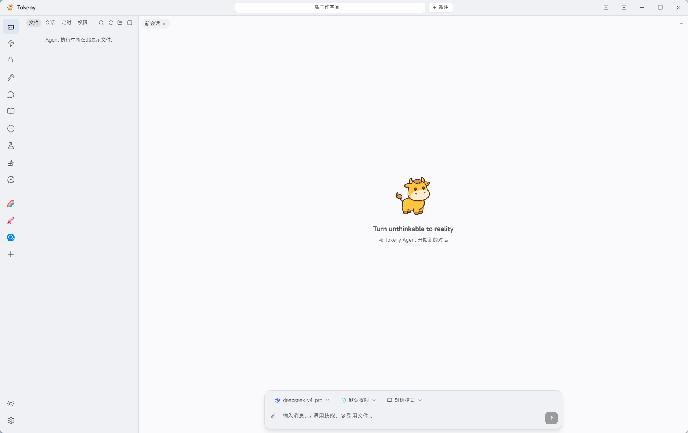
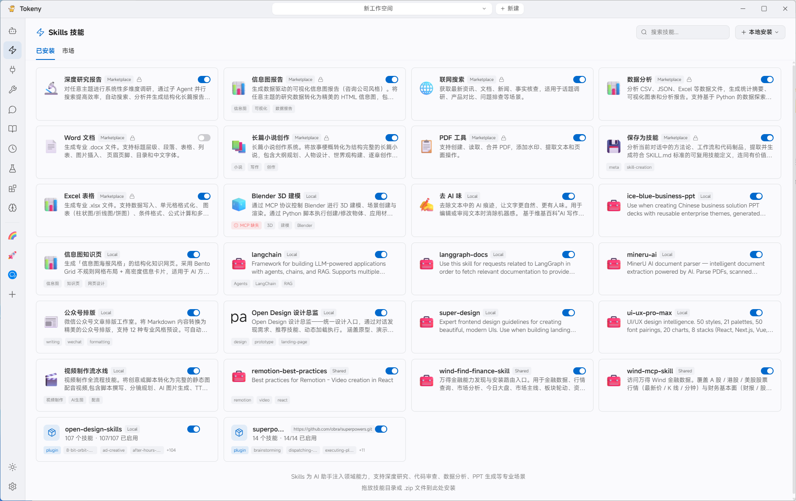
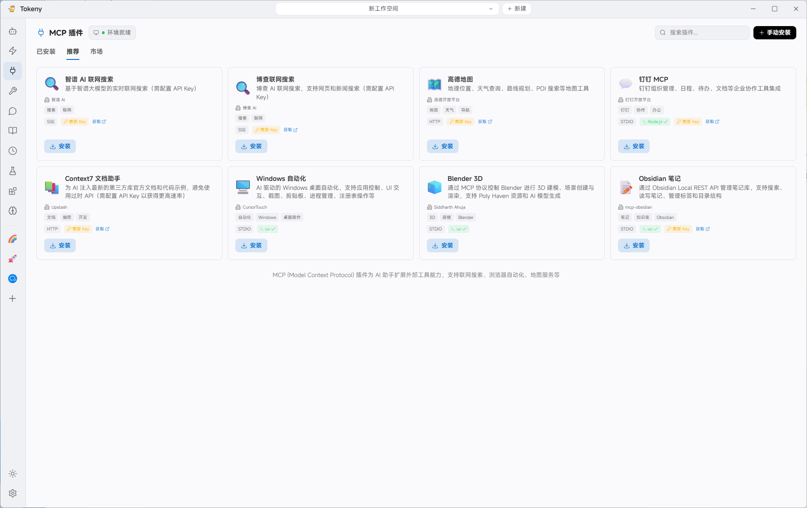
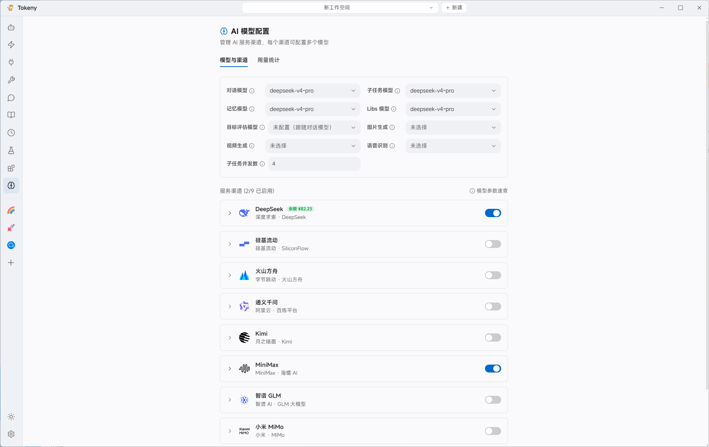
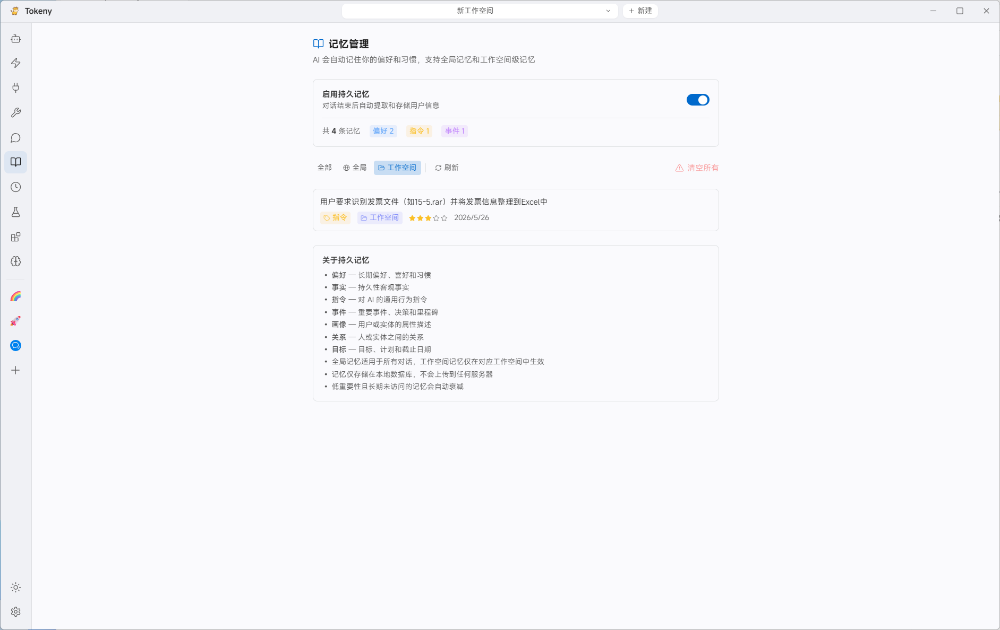
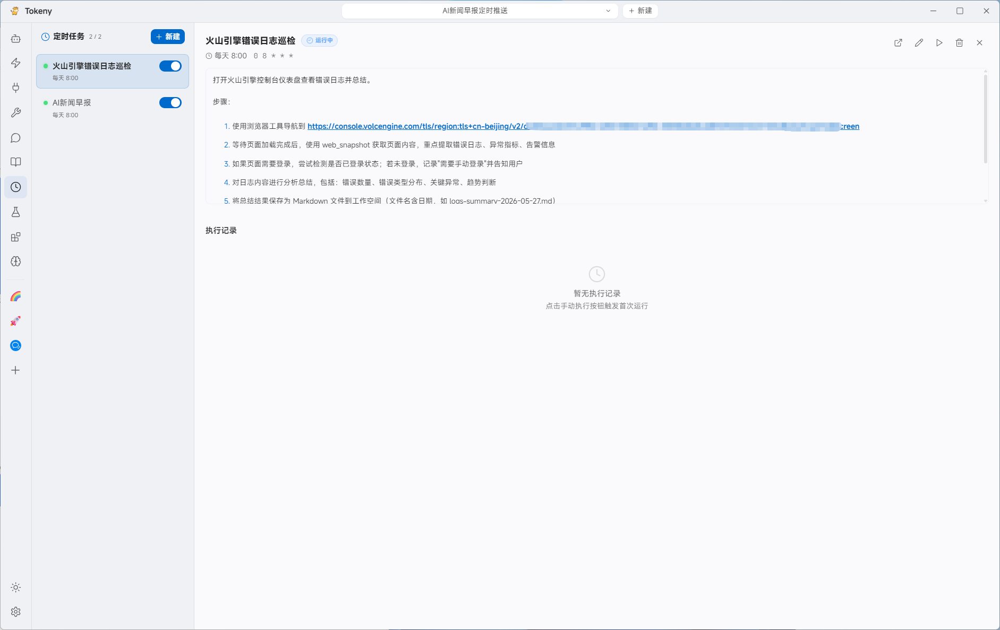
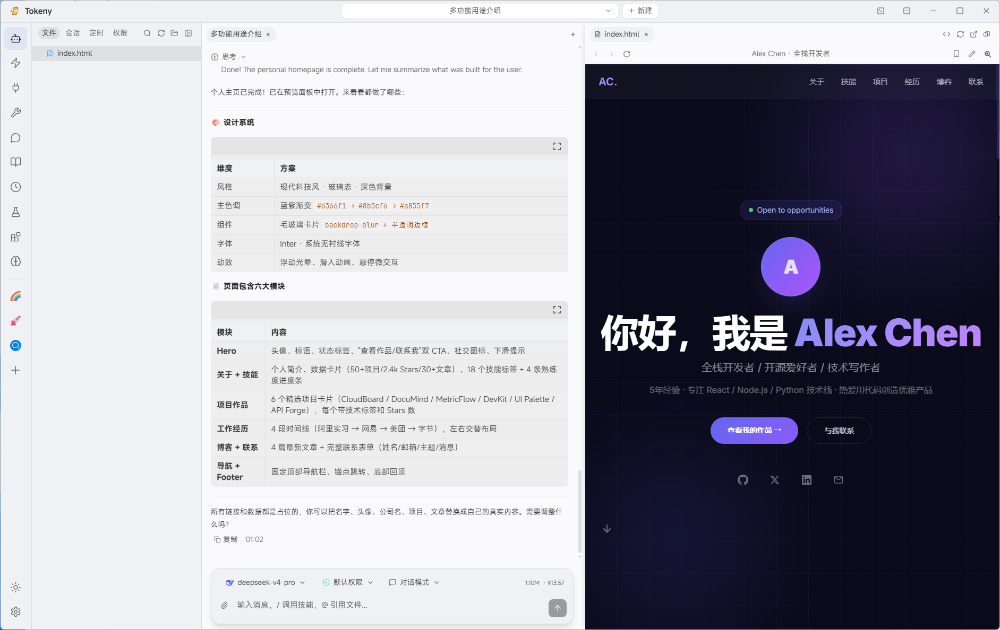
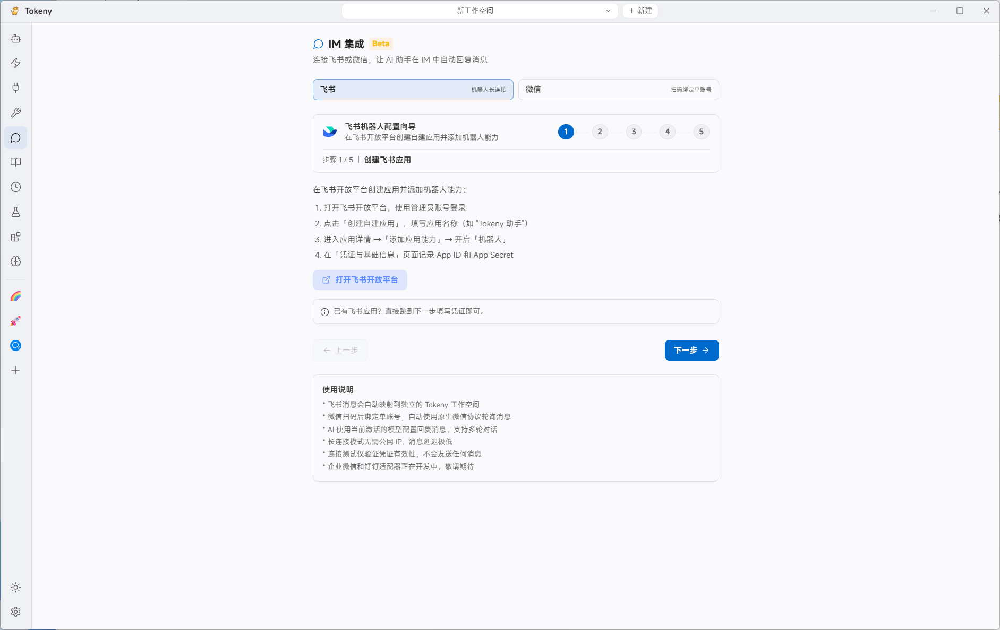
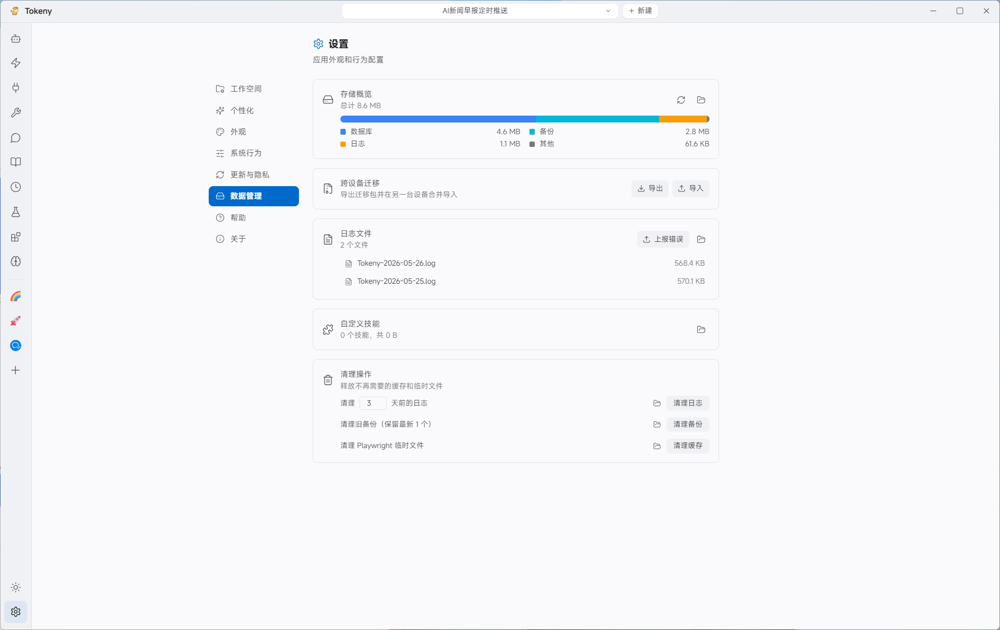

  

<h1 align="center">Tokeny</h1>

  <strong>你的桌面 AI Agent 工作台</strong>

  <a href="https://tokeny-ai.com">官网</a> ·
  <a href="#下载">下载</a> ·
  <a href="#界面预览">界面预览</a> ·
  <a href="#核心能力">核心能力</a> ·
  <a href="#系统要求">系统要求</a> ·
  <a href="#常见问题">常见问题</a>

---

Tokeny 是一个本地优先的桌面 AI 助手。它把多模型对话、Agent 工具调用、MCP 插件、Skills 技能、长期记忆、定时任务和 IM 集成放在同一个工作空间里，适合研究、写作、开发、运营和自动化任务。

数据默认保存在本机，模型请求只发送到你配置的 AI 服务商。你可以按工作空间管理文件、会话、权限、记忆和自动化流程。

## 下载

访问官网 [tokeny-ai.com](https://tokeny-ai.com)，或前往 [GitHub Releases](../../releases) 下载最新版安装包。

| 平台 | 安装包 | 说明 |
| --- | --- | --- |
| Windows x64 | `Tokeny-<version>-windows-x64.exe` | NSIS 安装包，支持自定义安装目录 |
| macOS Apple Silicon | `Tokeny-<version>-mac-arm64.dmg` | 适用于 Apple Silicon 芯片 |
| macOS Intel | `Tokeny-<version>-mac-x64.dmg` | 适用于 Intel 芯片 |
| Linux x64 | `Tokeny-<version>-linux-x64.AppImage` | AppImage 格式，无需安装 |

安装后至少配置一个模型渠道即可开始使用。

## 界面预览

### Agent 工作空间

Tokeny 的主界面围绕工作空间组织。Agent 可以读取工作区文件、执行工具、生成内容，并在同一界面里沉淀会话和任务结果。

### Skills 技能

Skills 为 Agent 注入领域能力，适合深度研究、数据分析、文档生成、PPT 制作等专业场景。

### MCP 插件

MCP 插件用于连接外部工具和服务，例如联网搜索、浏览器自动化、地图服务、笔记系统和 3D 建模工具。

### 模型、记忆与自动化

你可以为对话、子任务、记忆、知识库、图片生成、语音识别等用途分别选择模型。Tokeny 支持持久记忆和定时任务，适合日报推送、日志巡检、资料整理、周期性研究等自动化流程。

#### 模型配置

#### 记忆管理

#### 定时任务

#### 执行结果

### IM 集成与数据管理

Tokeny 支持将飞书、微信等消息入口接入桌面 AI 助手，让 Agent 在 IM 中自动处理消息。

### 数据管理

数据管理页提供存储概览、日志管理和跨设备迁移能力，便于备份和换机。

## 核心能力

- **多模型配置**：支持 OpenAI、Anthropic、DeepSeek、Google、MiniMax、硅基流动、火山方舟、Kimi、通义千问、智谱 GLM、小米 MiMo 以及兼容 OpenAI API 格式的服务。
- **Agent 执行环境**：基于工作空间运行，可读写文件、调用工具、拆解任务，并保留执行过程与结果。
- **MCP 插件系统**：通过 Model Context Protocol 扩展联网搜索、浏览器自动化、地图、笔记、企业协作和本地应用能力。
- **Skills 技能系统**：从技能市场安装或本地导入技能，为研究、代码、文档、表格、演示、视频、金融分析等场景提供专用能力。
- **长期记忆**：自动提取偏好、事实、指令和事件，支持全局记忆与工作空间记忆。
- **定时任务**：使用 Cron 表达式或固定周期运行 Agent 任务，支持手动触发和执行记录。
- **IM 集成**：连接飞书、微信等入口，让 AI 助手在消息流中回复和执行任务。
- **跨设备迁移**：导出和导入工作空间、会话、记忆、MCP、Skills 等数据，敏感信息可加密保护。
- **本地优先**：数据存储在本机 SQLite，日志和缓存可在设置中查看、清理和备份。

## 快速开始

1. 从 [Releases](../../releases) 下载对应平台安装包。
2. 启动 Tokeny，进入设置中的 AI 模型配置。
3. 添加至少一个模型服务渠道，并选择默认对话模型。
4. 新建工作空间或打开已有项目目录。
5. 在输入框中直接对话，或通过 `/` 调用技能，通过 `@` 引用文件。

## 系统要求

- Windows 10 及以上，x64
- macOS 12 Monterey 及以上，arm64 或 x64
- 建议内存 8 GB 及以上
- 建议预留 500 MB 以上磁盘空间

## 常见问题

### Tokeny 会上传我的本地数据吗？

Tokeny 的工作空间、会话、记忆、日志和配置默认存储在本机。使用 AI 模型时，必要的提示词和上下文会发送给你配置的模型服务商；是否发送文件内容取决于你在会话中引用了哪些内容。

### 数据存储在哪里？

Windows 默认位于 `%APPDATA%/Tokeny`，macOS 默认位于 `~/Library/Application Support/Tokeny`。你也可以在设置的数据管理页查看存储概览、日志和迁移入口。

### 必须配置 API Key 吗？

需要。Tokeny 本身不内置模型服务，你需要配置至少一个 AI 服务商的 API Key 或兼容 OpenAI API 的 Base URL。

### 这是开源仓库吗？

当前仓库用于发布 Tokeny 安装包、截图和说明文档，不包含完整应用源码。

---

  Tokeny Team

